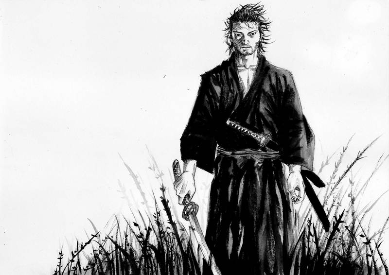
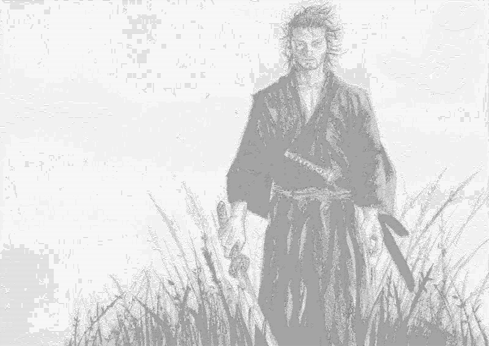
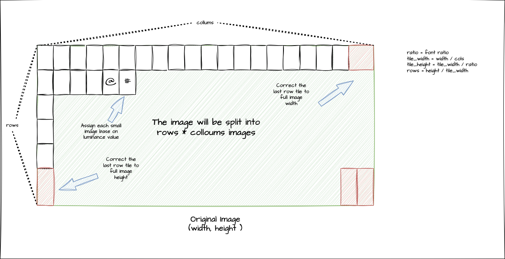

# Image-to-ASCII-art
A tool that creates ASCII art from an image, and outputs an ASCII image.

## Demo

## How it works
1. First convert the whole image to a grayscale to simplify the image data
2. Split the image into tiles with size m x n
3. Assign each tile with an ASCII value
4. Create the image from ASCII value and resize it to the original size

## Installation
1. Clone this repo: `git clone https://github.com/phuc50cm/Image-to-ASCII-art`
2. Change dir to the repo, create a virtual environment, and active it:
`cd Image-to-ASCII-art`
`python3 -m venv venv`
`source venv/bin/activate`
3. Install requirement library:
`pip install -r requirements.txt`

## Usage
After installation, run the command line to convert
usage: python convert.py [-h] [-f FILE] [-c COLS] [-l {10,70}]

Options:
  -h, --help            show this help message and exit
  -f FILE, --file FILE  the file being converted
  -c COLS, --cols COLS  the resolution of the resulting image
  -l {10,70}, --level {10,70}
                        grayscale level

Example:
python convert.py -f "my_image.png" -c 700 -l 70

Note:
- If you don't specify the -l option, it will take the default value (70)
- The resulting image will be "output.png"
